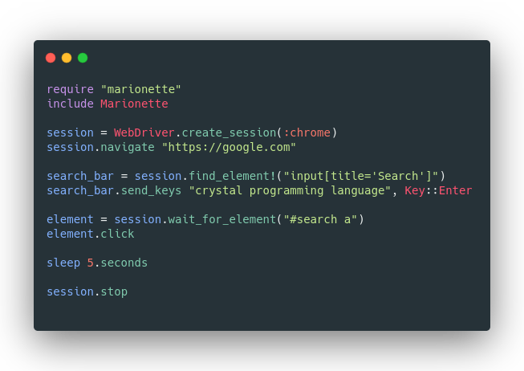

# Marionette

**Looking for a co-maintainer for Marionette**. If interested just respond in the issue titled "Looking for a co-maintainer".

    

<div align="center">
  
</div>

Marionette is a one-size-fits-all approach to WebDriver adapters. It works with most all web driver implementations, including:

- [x] Chrome
- [x] Chromium
- [x] Firefox
- [x] Safari
- [x] Edge
- [x] Internet Explorer
- [x] Opera
- [x] PhantomJS
- [x] Webkit GTK
- [x] WPE Webkit
- [x] Android

## Table of Contents

- [Marionette](#marionette)
  - [Table of Contents](#table-of-contents)
  - [Installation](#installation)
  - [WebDriver](#webdriver)
    - [Firefox](#firefox)
    - [Chrome](#chrome)
    - [Opera](#opera)
    - [Safari](#safari)
    - [Edge](#edge)
    - [Internet Explorer](#internet-explorer)
  - [Getting Started](#getting-started)
    - [Driver Capabilities](#driver-capabilities)
  - [Browser Manipulation](#browser-manipulation)
    - [Navigation](#navigation)
    - [Windows and Tabs](#windows-and-tabs)
    - [Frames and IFrames](#frames-and-iframes)
    - [Window Management](#window-management)
  - [Working with Elements](#working-with-elements)
  - [Contributing](#contributing)
  - [Contributors](#contributors)

## Installation

1. Make sure you have Crystal installed. This is a Crystal project and Crystal is required for usage. If you don't have it installed, see https://crystal-lang.org.

2. Add Marionette to an existing project by adding the dependency to your `shard.yml`

   ```yml
   dependencies:
     marionette:
       github: watzon/marionette
       branch: master
   ```

3. Run `shards install` to download and install Marionette as a dependency.

4. Download and have installed at least one [WebDriver](https://www.w3.org/TR/webdriver/). See the [#webdriver](#WebDriver) section below for links to various downloads.

## WebDriver

WebDriver is a protocol which allows browser implementations to be remote controlled via a common interface. It's because of this functionality that frameworks like Marionette are possible. To use the protocol you first have to have installed one of the many WebDriver implementations, here are some of those:

### Firefox

GeckoDriver is implemented and supported by Mozilla directly.

- [Downloads](https://github.com/mozilla/geckodriver/releases)
- [Documentation](https://firefox-source-docs.mozilla.org/testing/geckodriver/Support.html)

### Chrome

ChromeDriver is implemented and supported by the Chromium Project.

- [Downloads](https://sites.google.com/a/chromium.org/chromedriver/downloads)
- [Documentation](https://sites.google.com/a/chromium.org/chromedriver/)

### Opera

OperaChromiumDriver is implemented and supported by Opera Software.


- [Downloads](https://github.com/operasoftware/operachromiumdriver/releases)
- [Documentation](https://github.com/operasoftware/operachromiumdriver/releases)

### Safari

SafariDriver is implemented and supported directy by Apple. It comes pre-installed with Safari and Safari Technology Preview.

- [Documentation](https://developer.apple.com/documentation/webkit/about_webdriver_for_safari)

### Edge

Microsoft is implementing and maintaining the Microsoft Edge WebDriver.

- [Downloads](https://developer.microsoft.com/en-us/microsoft-edge/tools/webdriver/#downloads)
- [Documentation](https://developer.microsoft.com/en-us/microsoft-edge/tools/webdriver)

### Internet Explorer

Only version 11 is supported, and it requires additional [configuration](https://github.com/SeleniumHQ/selenium/wiki/InternetExplorerDriver#required-configuration).

**Note:** Marionette specific configuration instructions coming soon.

## Getting Started

The goal of Marionette is simplicity, which is why it's written in Crystal. Once you have a webdriver installed and sitting comfortably on your path, using it couldn't be easier:

```crystal
require "marionette"

session = Marionette::WebDriver.create_session(:chrome)

# Navigate to crystal-lang.org
session.navigate("https://crystal-lang.org")

# Start an action chain and perform it
session.perform_actions do
  # Click the "INSTALL" link
  click ".main-actions a:nth-child(1)"
end

sleep 5
session.close
```

### Driver Capabilities

Different drivers have different capabilities available to them. To make setting them a little easier, there's the `DriverOptions` module which is extended by `Marionette` itself. Take, for instance, Chrome:

```crystal
# Make this instance headless
options = Marionette.chrome_options(args: ["headless"])

# Create a Chrome session
session = Marionette::WebDriver.create_session(:chrome, capabilities: options)
```

`args` in this case are arguments to be passed to the browser itself rather than the driver. If you wish to pass arguments to the driver you can use the `args` parameter in the `create_session` method.

## Browser Manipulation

As shown above, you can initialize a new driver session for whatever driver you want using `Marionette::WebDriver.create_session`, the first and most important argument to which is `:browser`. Browser can be any of `:chrome`, `:firefox`, `:opera`, `:safari`, `:edge`, `:internet_explorer`, `:webkit_gtk`, `:wpe_webkit`, or `:android`.

If the driver for the chosen browser is installed under its usual name that should be all you need to do, if not you may need to provide the binary location via the `:exe_path` argument. Other notable arguments are:

- `:port` - sets the port you want the driver to listen on
- `:env`  - a hash of environment variables for the driver to be aware of
- `:args` - a string array of arguments to pass to the webdriver process
- `:options` - a JSON compatible structure containing browser options. see [here](./src/marionette/driver_options.cr) for some nice helpers.

### Navigation

#### `#navigate`

The first thing you will want to do after launching a browser is to open your website. This can be achieved in a single line:

```crystal
session.navigate("https://crystal-lang.org")
```

#### `#current_url`

You can read the current URL from the browser’s address bar using:

```crystal
session.current_url
# => https://crystal-lang.org
```

#### `#back`

Pressing the browser’s back button:

```crystal
session.back
```

#### `#forward`

Pressing the browser’s forward button:

```crystal
session.forward
```

#### `#refresh`

Refresh the current page:

```crystal
session.refresh
```

#### `#title`

You can read the current page title from the browser:

```crystal
session.title
# => Crystal | The Crystal Programming Language
```

### Windows and Tabs

WebDriver does not make the distinction between windows and tabs. If your site opens a new tab or window, Marionette will let you work with it using a window handle. Each window has a unique identifier which remains persistent in a single session.

#### `#current_window`

You can get the currently active window using:

```crystal
session.current_window
```

This returns a `Window` instance containing a handle and allowing certain functions to be performed directly on the window instance.

#### `#windows`

You can get an array of all currently opened windows using:

```crystal
session.windows
```

#### `#new_window`

You can create a new window or tab using:

```crystal
session.new_window(:window) # default
session.new_window(:tab)

# Or using the Window object

Marionette::Window.new(:window) # default
Marionette::Window.new(:tab)
```

#### `#switch_to_window`

To interact with other windows you have to switch to them, this can be done with:

```crystal
session.switch_to_window(window)

# Or using the Window object

window.switch
```

#### `#close_window`

When you are finished with a window or tab and it is not the last window or tab open in your browser, you should close it and switch back to the window you were using previously:

```crystal
session.close_window(window)

# Or using the Window object

window.close
```

#### `#close_current_window`

Think of this is a shortcut to `#close_window` but for the currently active window:

```crystal
session.close_current_window
```

#### `#stop`

When you are finished with the browser session you should call `stop`, instead of `close`:

```crystal
session.stop
```

Stop will:
- Close all the windows and tabs associated with that WebDriver session
- Close the browser process
- Close the background driver process

Stop will be automatically closed on process exit.

### Frames and IFrames

Frames are a now deprecated means of building a site layout from multiple documents on the same domain. You are unlikely to work with them unless you are working with an pre HTML5 webapp. Iframes allow the insertion of a document from an entirely different domain, and are still commonly used.

If you need to work with frames or iframes, WebDriver allows you to work with them in the same way. Consider a button within an iframe. If we inspect the element using the browser development tools, we might see the following:

```html
<div id="modal">
  <iframe id="buttonframe" name="myframe"  src="https://watzon.github.io">
   <button>Click here</button>
 </iframe>
</div>
```

If it was not for the iframe we would expect to click on the button using something like:

```crystal
session.find_element!("button").click
```

However, if there are no buttons outside of the iframe, you might instead get a _no such element error_. This happens because Marionette is only aware of the elements in the top level document. To interact with the button, we will need to first switch to the frame, in a similar way to how we switch windows. WebDriver offers three ways of switching to a frame.

#### `#switch_to_frame`

The `switch_to_frame` session method allows us to tell the WebDriver that we want to switch the page context to the given frame/iframe:

```crystal
# Find the element
iframe = session.find_element!("#modal>iframe")

# Switch to the frame
session.switch_to_frame(iframe)

# Now we can click the button
session.find_element!("button").click
```

#### `#switch_to_parent_frame`

If you're in a nested set of frames you can switch back to the parent frame using:

```crystal
session.switch_to_parent_frame
```

#### `#leave_frame`

When you're done inside a frame and want to get back to the normal document context you can use:

```crystal
session.leave_frame
```

### Window Management

Screen resolution can impact how your web application renders, so WebDriver provides mechanisms for moving and resizing the browser window.

#### `#size`

You can fetch window dimensions either collectively or individually:

```crystal
# First get the current window
window = session.current_window

# Access dimensions individually
width = window.width
height = window.height

# Or collectively as a Size object
window.size
# => Size(width: 800.0, height: 600.0)
```

#### `#resize_to`

To resize the window:

```crystal
window.resize_to(600, 800)

# Or using an existing Size object `size`

window.size = size
```

#### `#position`

You can fetch the coordinates of the top left corner of the browser window:

```crystal
window.position
# => Location(x: 0.0, y: 0.0)
```

#### `#move_to`

You can also easily set the position of the window:

```crystal
window.move_to(250, 250)

# Or using a Location object `location`

window.position = location
```

#### `#maximize`

To maximize the given window:

```crystal
window.maximize
```

#### `#minimize`

To minimize the given window:

```crystal
window.minimize
```

#### `#fullscreen`

To make the given window full screen:

```crystal
window.fullscreen
```

## Working with Elements

`Element` represents a DOM element. WebElements can be found by searching from the document root using a WebDriver instance, or by searching under another `Element`.

WebDriver API provides built-in methods to find the WebElements which are based on different properties like ID, Name, Class, XPath, CSS Selectors, link Text, etc.

#### `#active_element`

Get and return the active element:

```crystal
session.active_element
```

#### `#find_element`

`find_element` and `find_element!` are used to find and store references to page elements. The only difference between the two is that `find_element!` will throw an exception if the element is not found and will not be nil, whereas `find_element` will return nil if the element is not found.

```crystal
# Get the search box element by name
search_bar = session.find_element!("q", :name)

# Peform an action
search_bar.send_keys("Crystal programming language")

# Click the submit button (using the default :css option this time)
session.find_element!("button.submit").click
```

#### `#find_elements`

Used to find an array of elements matching the given selector:

```crystal
# Get all elements with the tag name "p"
elements = session.find_elements("p", :tag_name)

elements.each do |el|
  puts el.text
end
```

#### `#find_child`

Used to find a child element within the context of parent element. Like `find_element` it has raising and non-raising varients:

```crystal
# Find the search form
form = session.find_element!("form", :tag_name)

# Find the form's child search box
search_bar = form.find_child!("q", :name)

search_bar.send_keys("Crystal programming language")
```

#### `#find_children`

Just like `find_elements` and `find_child`:

```crystal
element = session.find_element!("div", :tag_name)

paragraphs = element.find_children("p", :tag_name)

paragraphs.each do |para|
  puts para.text
end
```

## Contributing

1. Fork it ( https://github.com/watzon/marionette/fork )
2. Create your feature branch (git checkout -b my-new-feature)
3. Commit your changes (git commit -am 'Add some feature')
4. Push to the branch (git push origin my-new-feature)
5. Create a new Pull Request

## Contributors

This project exists thanks to all the people who contribute. <a href="https://github.com/cadmiumcr/Cadmium/graphs/contributors"></a>
